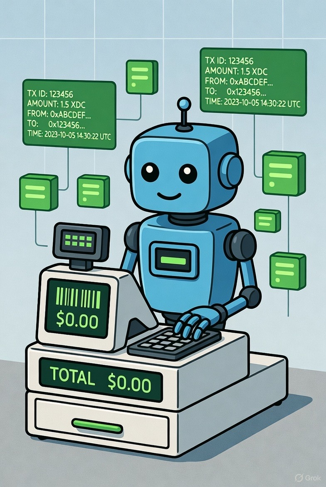

_Live page is located at: https://s4njk4n.github.io/XDC_Proof/_

# XDC Proof - Generate PDF Receipts for XDC Transactions



This is a simple web app that lets you create PDF receipts from XDC Network transactions. It pulls transaction details from the blockchain and turns them into a nice, verifiable PDF with a QR code linking back to XDCScan. Everything runs in your browser—no data gets sent to any server except for the public RPC calls to fetch transaction info. Your custom details stay in local storage on your device.

It's handy if you need receipts for accounting, invoices, or just to show proof of payment. I built it for folks working with XDC, like in trade finance or basic bookkeeping.

[Try it out here](https://s4njk4n.github.io/XDC_Proof/)

## Features
- Create a single receipt from a transaction hash.
- Map wallet addresses to names and details for auto-filling (using a CSV).
- Generate batches of receipts from a list in a CSV.
- Dark mode switch for easier reading.
- Option to use a custom RPC endpoint (defaults to a public one).
- Basic checks to make sure inputs are valid.

## Getting Started
Just open the link above in your browser.

### How to Generate a Single Receipt
This is the basic way to make one receipt at a time. Good for beginners just trying it out.

1. Paste the transaction hash (it looks like `0x` followed by a bunch of letters and numbers) into the first field. The app will fetch details like who sent it, who received it, the amount, and when it happened.
2. Write a short description of what the payment was for, like "Payment for invoice #456".
3. (Optional) Add details about the seller and buyer, such as names, addresses, phone numbers, or emails. If you have bulk mapping set up (see below), this might fill in automatically.
4. (Optional) Put in a URL for the seller's logo (a .png or .jpg image).
5. (Optional) Change the RPC URL if you want a different node (the default is https://rpc.ankr.com/xdc, which works fine for mainnet).
6. Hit "Generate Proof" and the page will locally create a PDF on your machine and prompt you to save it. The PDF has a QR code you can scan to check the transaction on XDCScan.

Since it all happens locally, your info doesn't go anywhere except the quick check on the blockchain.

### What is Bulk Entity Mapping?
This lets you link wallet addresses to real-world details, like company names or contacts. It's useful if you deal with the same addresses a lot—it auto-fills the seller/buyer fields when you enter a transaction hash. Everything is saved in your browser's local storage, so it's private and sticks around until you clear it.

How to set it up:
1. Download the sample CSV from the app (there's a link in the section).
2. Open it in something like Excel or a text editor, and add your own rows.
3. Upload the CSV back into the app, or paste the text directly.
4. The app saves it locally in your browser's "local storage" and shows how many entries it loaded.
5. Now, when you generate a receipt, if the sender or receiver matches an address in your CSV, the details fill in.
6. To remove it, click "Clear saved CSV".

CSV format: It's a table with headers. Make sure every value is in double quotes, especially if there are commas inside (like in addresses).
```
  "address","name","company","address_line","phone","email","logo_url"
  "xdc1a2b3c4d5e6f7g8h9i0j1k2l3m4n5o6p7q8r9s0t","Acme Corp","Acme Corporation","123 Main St, Suite 100, New York, NY 10001","555-1000","acme@corp.com","https://i.imgur.com/acme.png"
  "xdc9f8e7d6c5b4a3f2e1d0c9b8a7f6e5d4c3b2a1f0","Global Trade","Global Trade Ltd","456 Port Ave, #12-34, Singapore 098765","555-2000","global@trade.com","https://i.imgur.com/global.png"
```


- `address`: The wallet address (starts with xdc or 0x).
- `name`: Short name or display name.
- `company`: Full company name.
- `address_line`: Street address.
- `phone`: Phone number.
- `email`: Email.
- `logo_url`: Link to a logo image (optional). Recommended: 400×400 px or larger, square PNG with transparent background for best quality

Easiest way: "Download" the sample csv from the link directly on the page, tweak it in a spreadsheet or text editor, and upload. No need to start from scratch.

### What is Batch Generate?
If you have a list of transactions, this creates multiple PDFs at once and zips them up. It works well with bulk mapping for auto-filling details. Again, all local—no uploading files anywhere.

How to use it:
1. Download the sample CSV from the app.
2. Edit it to add your transaction hashes and descriptions.
3. Upload the CSV into the batch section.
4. Click "Generate All". It'll show a progress bar.
5. When done, it downloads a ZIP with all the PDFs.
6. If you need to stop, hit "Cancel".

CSV format: Simple—just the hash and description per row, in quotes.
```
  "tx_hash","description"
  "0x7f8c9d2b1a3e4f5c6d7b8a9e0f1c2d3b4e5a6f7c8d9e0a1b2c3d4e5f6a7b8c9","Invoice #501: 500 Widgets"
  "0x1a2b3c4d5e6f7g8h9i0j1k2l3m4n5o6p7q8r9s0t1u2v3w4x5y6z","Consulting Q3 2025"
```


- `tx_hash`: The full transaction hash (0x...).
- `description`: What the payment was for.

Tip: Set up bulk mapping first if your transactions involve known addresses—it'll add those details to the batch PDFs automatically. Use the sample CSV to get going quickly.

## Contact
Got questions or issues? Hit me up:
- Telegram: [@s4njk4n](https://t.me/s4njk4n)
- Discord: @s4njk4n
- X: [@s4njk4n](https://x.com/s4njk4n)
- GitHub: [s4njk4n](https://github.com/s4njk4n)

© 2025 XDC Outpost. MIT Licensed. Put together by s4njk4n.
